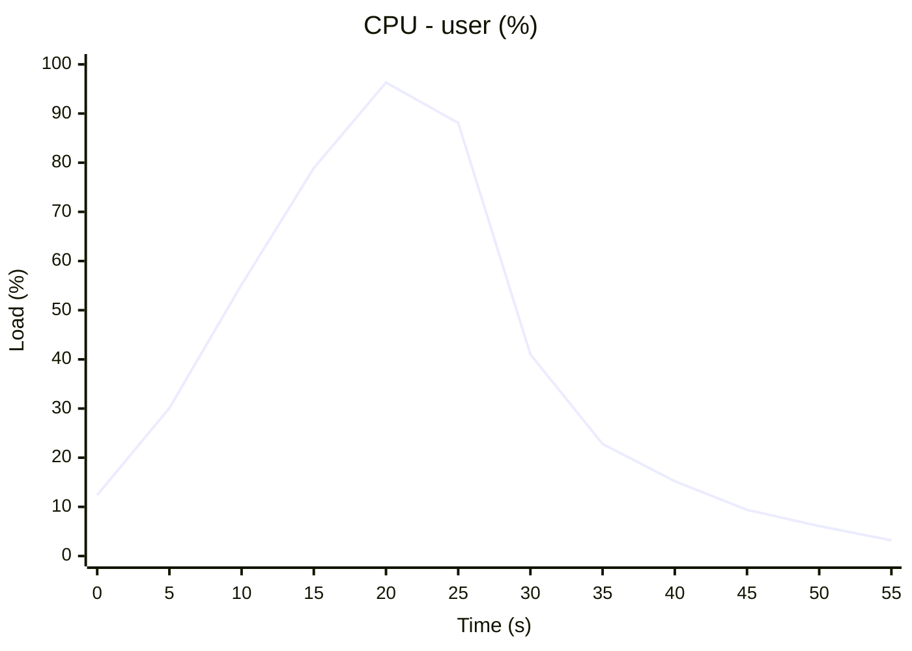

# workflow-telemetry-action

> **Status: hard fork, maintained for my own use.** This is a hard fork of
> [catchpoint/workflow-telemetry-action](https://github.com/catchpoint/workflow-telemetry-action),
> which is dead: no releases in years, and issues and pull requests piling up
> unanswered. By the time of this fork the action had stopped working in several
> ways on current runners - the chart backend it called had been shut down, and
> process tracing had silently switched itself off.
>
> I forked it because I want to use it. It is maintained on a best-effort basis,
> for my own purposes, with no promise of support or stability. Issues and pull
> requests are welcome but may sit. If you depend on this, pin a tag.
>
> Diverged from upstream at
> [`f974e0c`](https://github.com/catchpoint/workflow-telemetry-action/commit/f974e0c).

A GitHub Action to track and monitor the

- workflow runs, jobs and steps
- resource metrics
- and process activities

of your GitHub Action workflow runs. If the run is triggered via a Pull Request,
it will create a comment on the connected PR with the results and/or publishes
the results to the job summary.

The action traces the jobs' step executions and shows them in trace chart,

And collects the following metrics:

- CPU Load (user and system) in percentage
- Memory usage (used and free) in MB
- Network I/O (read and write) in MB
- Disk I/O (read and write) in MB

And traces the process executions (Linux runners, x64 and arm64)

as trace chart with the following information:

- Name
- Start time
- Duration (in ms)
- Finish time
- Exit status as success or fail (highlighted as red)

and as trace table with the following information:

- Name
- Id
- Parent id
- User
- Start time
- Duration (in ms)
- Exit code
- File name
- Arguments

> **Cost:** process tracing installs `forkstat` on first use, measured at about
> 5s on x64 and 9s on arm64. Everything else the action does needs no setup. On
> workflows with many short jobs - a build matrix that mostly hits its cache,
> say - it is worth setting `proc_trace_enable: false` there and leaving it on
> for the long jobs where the trace actually tells you something.

> **Note on process tracing** Process tracing uses
> [forkstat](https://github.com/ColinIanKing/forkstat), installed from the
> distribution's package manager on first use. It reads the kernel's
> process-event connector, so it needs `sudo` but no eBPF, kernel headers or a
> matching kernel version, and works on x64 and arm64 alike. Earlier versions
> shipped prebuilt closed-source x86-64 eBPF binaries in `dist/`, which only ran
> on Ubuntu 20.04 and 22.04 and therefore stopped working entirely once the
> runners moved on. If `forkstat` cannot be installed, tracing is skipped and
> the rest of the telemetry still works.

> **Note on charts** Output is text by default — sparklines and bars in markdown
> tables — and the `charts: mermaid` input switches it to diagrams. The reason
> is the `charts` option below: mermaid costs the _page_, not the runner, and
> that cost is per job. Nothing is sent anywhere in either mode; earlier
> versions posted the data to a third-party chart-image service that no longer
> exists, so those charts came out broken.

### Example Output

By default everything is rendered as text, which costs the page nothing however
many jobs report into it.

Resource metrics come out as one table, with the sparkline carrying the shape
and the columns beside it carrying the numbers the sparkline deliberately does
not:

| Metric             | Trace                                           |    Peak |    Mean |
| :----------------- | :---------------------------------------------- | ------: | ------: |
| CPU - user         | `▁▁▁▅▆▆▇▇▇▇████▇▇▇▇▇█████▇▇▇▇▇████▇▇▇▇▇█▂▂▂▂▂▂` |  96.0 % |  70.3 % |
| CPU - system       | `▁▁▁███▇▆▅▄▃▃▃▃▄▅▆▇███▇▇▆▅▄▃▃▃▄▄▅▆▇███▇▆▅▄▄▃▃▃` |  13.0 % |   8.5 % |
| Memory - used      | `▁▁▁▂▂▂▂▂▃▃▃▃▃▄▄▄▄▄▅▅▅▅▅▆▆▆▆▆▇▇▇▇▇████████████` | 4060 MB | 2735 MB |
| Network I/O - read | `█▇▅▄▁▁▁▁▁▁▁▁▁▁▁▁▁▁▁▁▁▁▁▁▁▁▁▁▁▁▁▁▁▁▁▁▁▁▁▁▁▁▁▁▁` | 22.0 MB |  1.5 MB |
| Disk I/O - write   | `▁▁▁▁▁▁▁▁▁▁▁▁▁▁▁▁▁▁▁▁▁▁▁▁▁▁▁▁▁▁▁▁▁▁▁▁▁▅███████` | 95.0 MB | 20.8 MB |

A sparkline is scaled to its own series, so the shape is visible whatever the
magnitude; a flat series is drawn at the floor when it is zero and mid-height
when it is not, so an idle NIC and a pegged CPU do not look alike.

The step and process traces come out as the same picture a gantt chart draws,
one row per span:

| Step                 | Duration | Timeline (7m 29s)                |
| :------------------- | -------: | :------------------------------- |
| Set up job           |     2.0s | `█░░░░░░░░░░░░░░░░░░░░░░░░░░░░░` |
| Run actions/checkout |     4.0s | `█░░░░░░░░░░░░░░░░░░░░░░░░░░░░░` |
| Build package        |    7m 2s | `█████████████████████████████░` |
| Upload artifact      |    17.0s | `░░░░░░░░░░░░░░░░░░░░░░░░░░░░██` |

With `charts: mermaid`, the traces are rendered as Mermaid gantt charts and each
metric series as its own `xychart` block:




## Usage

To use the action, add the following step before the steps you want to track.

```yaml
permissions:
  pull-requests: write
jobs:
  workflow-telemetry-action:
    runs-on: ubuntu-latest
    steps:
      - name: Collect Workflow Telemetry
        uses: fwilhe2/workflow-telemetry-action@v3
```

## Configuration

| Option                       | Requirement | Description                                                                                                                                                                                                                       |
| ---------------------------- | ----------- | --------------------------------------------------------------------------------------------------------------------------------------------------------------------------------------------------------------------------------- |
| `github_token`               | Optional    | An alternative GitHub token, other than the default provided by GitHub Actions runner.                                                                                                                                            |
| `charts`                     | Optional    | How traces and metrics are drawn: `sparkline` (text in markdown tables) or `mermaid` (diagrams). Defaults to `sparkline`. See the note below before choosing `mermaid` on a matrix.                                               |
| `metric_frequency`           | Optional    | Metric collection frequency in seconds. Must be a number. Defaults to `5`.                                                                                                                                                        |
| `proc_trace_enable`          | Optional    | Set to `false` to skip process tracing. It is the only part of the action that installs anything (`forkstat`, ~5s on x64 and ~9s on arm64) and the only part needing `sudo`. Resource metrics are unaffected. Defaults to `true`. |
| `proc_trace_min_duration`    | Optional    | Puts minimum limit for process execution duration to be traced. Must be a number. Defaults to `-1` which means process duration filtering is not applied.                                                                         |
| `proc_trace_chart_max_count` | Optional    | Maximum number of processes to be shown in trace chart. Must be a number. Defaults to `100`.                                                                                                                                      |
| `proc_trace_table_show`      | Optional    | Enables showing traced processes in trace table. Defaults to `false`.                                                                                                                                                             |
| `comment_on_pr`              | Optional    | Set to `true` to publish the results as comment to the PR (applicable if workflow run is triggered by PR). Defaults to `true`. <br/> Requires `pull-requests: write` permission                                                   |
| `job_summary`                | Optional    | Set to `true` to publish the results as part of the [job summary page](https://github.blog/2022-05-09-supercharging-github-actions-with-job-summaries/) of the workflow run. Defaults to `true`.                                  |

> **Cost of `charts: mermaid`:** GitHub renders every mermaid block in its own
> sandboxed iframe served from `viewscreen.githubusercontent.com`, which loads
> mermaid.js and lays the diagram out in the browser. One job's telemetry is a
> dozen of those, which is fine on a job page. The run summary page concatenates
> every job's summary, so a matrix multiplies that by the job count — a 77-job
> workflow asks the browser for around 850 iframes and the page stops being
> usable. The text output has no such cost, which is why it is the default;
> enable `mermaid` on the one job under investigation instead.

## Development

This action follows the layout of
[actions/typescript-action](https://github.com/actions/typescript-action): the
sources in `src/` are TypeScript ES modules, bundled by
[rollup](https://rollupjs.org/) into the self-contained bundles under `dist/`
that the runner actually executes.

Requires Node.js 24 (see `.node-version`).

```bash
npm ci
npm run all
```

`npm run all` formats, lints, runs the unit tests, rebuilds `dist/` and then
smoke tests the bundles. The individual steps are:

| Script                       | What it does                                                       |
| ---------------------------- | ------------------------------------------------------------------ |
| `npm run lint`               | ESLint over the whole repo                                         |
| `npm run check:node-version` | Asserts the Node version is declared consistently                  |
| `npm test`                   | Jest unit tests in `__tests__/`                                    |
| `npm run package`            | Rebuilds the three bundles in `dist/`                              |
| `npm run smoke-test`         | Loads the built bundles and exercises the stat collector over HTTP |
| `npm run format:write`       | Formats with Prettier                                              |

`dist/` is committed, so **rebuild and commit it with every source change** —
the `Check Transpiled JavaScript` workflow fails when it drifts from `src/`.

### Moving to a new Node version

The Node major version the action runs on is written down in four places, and
they must agree:

| File            | Field                             |
| --------------- | --------------------------------- |
| `action.yml`    | `runs.using: nodeNN`              |
| `.node-version` | the version CI and you build with |
| `package.json`  | `engines.node`                    |
| `package.json`  | `devDependencies.@types/node`     |

`@types/node` matters most: if it describes a newer runtime than the action
actually runs on, TypeScript accepts APIs that are missing at run time. So
Dependabot is told to hold `@types/node` at its current major
(`.github/dependabot.yml`); that ignore follows `package.json`, so it tracks the
runtime automatically rather than naming a version of its own.

To move to a new Node version, edit all four together, then:

```bash
npm install --save-dev @types/node@<new major>
npm run all
```

`npm run check:node-version` (part of `npm run all`, and a CI step) fails if any
of them drift apart, or if the Dependabot guard is removed.

### Why the bundles are split

| Bundle      | Entry point                  | Purpose                                    |
| ----------- | ---------------------------- | ------------------------------------------ |
| `dist/main` | `src/main.ts`                | The action's `main` step                   |
| `dist/post` | `src/post.ts`                | The action's `post` step, reports results  |
| `dist/scw`  | `src/statCollectorWorker.ts` | Spawned as its own process, serves metrics |

## Releasing

Releases are cut by the `Release` workflow, which tags whatever version is
already in `package.json`. There is no `npm version` step, so the version bump
is an ordinary commit that goes through review and CI like anything else.

1. Add the release to [CHANGELOG.md](CHANGELOG.md).
2. Bump `version` in `package.json`.
3. `npm run all`, then commit — including the rebuilt `dist/`.
4. Push to `main` and let CI go green.
5. Run the **Release** workflow (Actions → Release → Run workflow) **from the
   ref you are releasing** — `main` for the current major, `releases/vN` for a
   fix to an older one. Tick `dry_run` first if you want to see the version it
   resolves and confirm every check passes without publishing anything.

The workflow then:

- rebuilds `dist/` and **fails if it differs** from what is committed, so a
  release can never ship bundles that do not match `src/`
- runs the unit tests and the smoke test
- **fails if the tag already exists**, rather than moving it
- **fails if `releases/vN` holds commits the released ref does not**, rather
  than dropping them
- tags `vX.Y.Z`, force-moves the major tag `vX`, and fast-forwards the release
  branch `releases/vX` to the same commit
- creates a GitHub release with generated notes, marked _Latest_ only if this
  really is the newest version in the repository

### Tags and branches

Three refs move with a release, and they mean different things:

| Ref           | Moves         | For                                      |
| ------------- | ------------- | ---------------------------------------- |
| `v3.1.0`      | never         | pinning an exact version                 |
| `v3`          | every release | what users reference in `uses:`          |
| `releases/v3` | every release | where maintenance for that major happens |

The major tag is the one users reference
(`uses: fwilhe2/workflow-telemetry-action@v3`), which is why it moves with every
release in that series. Bumping the major means users have to opt in by changing
their `uses:` line, so reserve it for changes that break existing workflows —
see 3.0.0 in the changelog for the kind of thing that qualifies.

The release branch is what makes an old major still maintainable once `main` has
moved on: land the fix on `releases/v3`, bump the version there, and dispatch
the workflow from that branch. It tags `v3.x.y` and moves `v3`, and it will not
mark the release _Latest_ while a newer major exists. Releases cut from `main`
fast-forward the branch instead, so the two stay in sync until a major is
actually left behind — which is why nothing extra is needed for ordinary
releases.

It uses the built-in `GITHUB_TOKEN` with `contents: write`; no secrets need
configuring.

## Credits and licence

Originally written by Serkan Özal and contributors at Thundra / Runforesight /
Catchpoint, and licensed under the Apache License 2.0 (Copyright 2022 Thundra,
Inc.). This fork keeps that licence and copyright unchanged, see
[LICENSE.md](LICENSE.md).

Upstream's `package.json` declared `MIT` while its `LICENSE` file was Apache 2.0
and contained no MIT text. The authors confirmed Apache 2.0 was the intent in
[catchpoint/workflow-telemetry-action#18](https://github.com/catchpoint/workflow-telemetry-action/issues/18),
so this fork corrects the metadata to `Apache-2.0`. That is a fix to a wrong
declaration, not a relicence: a fork cannot change the licence of code it did
not write.

As required by section 4(b) of the licence, this is a modified version of the
original work. [CHANGELOG.md](CHANGELOG.md) lists the changes made since the
fork point.
